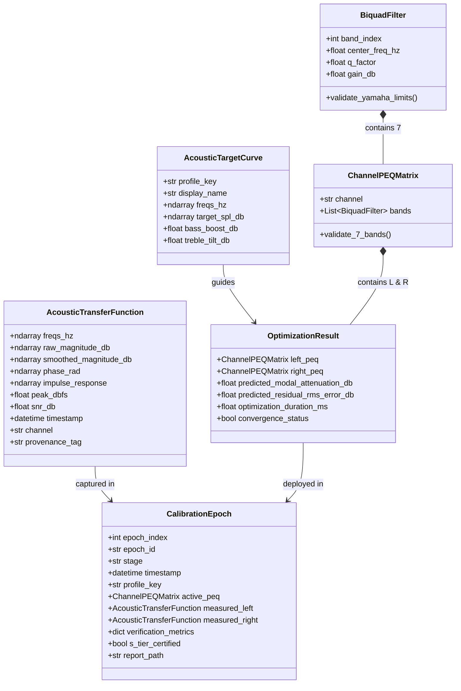

# Phase 1 Data Model: Acoustic Calibration & Optimization Engine

**Feature Branch**: `001-audit-refactor-measurements`  
**Date**: 2026-09-03  
**Status**: Complete

---

## 1. Entity Overview & Relationship Diagram

---

## 2. Entity Definitions & Validation Rules

### 2.1 Acoustic Transfer Function (`AcousticTransferFunction`)
Represents an authentic deconvolved room acoustic response.
* **Fields**:
  * `freqs_hz` (`np.ndarray[float64]`): Frequency vector, strictly monotonically increasing from $20.0\text{ Hz}$ to $20000.0\text{ Hz}$.
  * `raw_magnitude_db` (`np.ndarray[float64]`): Unsmoothed magnitude response normalized to reference listening level ($75-85\text{ dB SPL}$).
  * `smoothed_magnitude_db` (`np.ndarray[float64]`): Psychoacoustically smoothed response (e.g. 1/24th-octave or ERB filter bank).
  * `impulse_response` (`np.ndarray[float32]`): Deconvolved raw time-domain impulse response at $48\text{ kHz}$.
  * `peak_dbfs` (`float`): Peak recording amplitude. Must satisfy $[-24.0, -3.0]\text{ dBFS}$ (anti-clipping rule).
  * `snr_db` (`float`): Signal-to-noise ratio. Must be $\ge 14.0\text{ dB}$ to be valid for optimization.
  * `timestamp` (`str`): ISO-8601 UTC string.
  * `channel` (`str`): `'L'` or `'R'`.
  * `provenance_tag` (`str`): Must be `'REAL_MEASUREMENT'`.
* **Validation Invariants**:
  * Any synthetic or simulated curve is prohibited from using the `'REAL_MEASUREMENT'` tag.

### 2.2 Discrete Biquad Filter (`BiquadFilter`)
Represents a single parametric equalization biquad band compliant with Yamaha RX-V673 hardware limitations.
* **Fields**:
  * `band_index` (`int`): $1$ to $7$.
  * `center_freq_hz` (`float`): Must belong strictly to the 28 allowable discrete values:
    `[62.5, 78.7, 99.2, 125.0, 157.5, 198.4, 250.0, 315.0, 396.9, 500.0, 630.0, 793.7, 1000.0, 1260.0, 1587.4, 2000.0, 2520.0, 3174.8, 4000.0, 5040.0, 6349.6, 8000.0, 10080.0, 12700.0, 16000.0]` (plus sub-octaves `[31.3, 39.4, 49.6]` if supported by model firmware).
  * `q_factor` (`float`): Must belong strictly to the 14 allowable discrete values:
    `[0.500, 0.630, 0.794, 1.000, 1.260, 1.587, 2.000, 2.520, 3.175, 4.000, 5.040, 6.350, 8.000, 10.080]`.
  * `gain_db` (`float`): Must range from $-12.0\text{ dB}$ to $+3.0\text{ dB}$ in discrete steps of $0.5\text{ dB}$.
* **Validation Invariants**:
  * If `center_freq_hz > 500.0`, `gain_db` MUST be $\le 0.0\text{ dB}$ (no high-frequency room correction boost).
  * Maximum positive boost anywhere is $+3.0\text{ dB}$.
  * Minimum cut is $-12.0\text{ dB}$.

### 2.3 Channel PEQ Matrix (`ChannelPEQMatrix`)
Contains exactly 7 discrete biquads for one channel.
* **Fields**:
  * `channel` (`str`): `'L'` or `'R'`.
  * `bands` (`List[BiquadFilter]`): Array of exactly 7 filters. Unused bands are set to `gain_db = 0.0`.
* **Validation Invariants**:
  * Front Left and Front Right center frequencies and Q factors are independently calculated ($f_{0,L} \neq f_{0,R}$) to correct asymmetrical room boundary coupling.

### 2.4 Calibration Epoch (`CalibrationEpoch`)
An immutable, version-controlled calibration snapshot.
* **Fields**:
  * `epoch_index` (`int`): Sequential zero-based index ($0, 1, 2, ...$).
  * `epoch_id` (`str`): Unique identifier (e.g. `epoch_000_baseline_20260903_190000`).
  * `stage` (`str`): Enum `['baseline', 'initial_peq', 'refined_notch', 'final_certified']`.
  * `timestamp` (`str`): ISO-8601 UTC.
  * `profile_key` (`str`): Acoustic profile key (e.g. `harman_wide_room`, `bk_1974`, `dirac_live`).
  * `peq_matrix` (`dict`): Serialized Left and Right `ChannelPEQMatrix`.
  * `metrics` (`dict`):
    * `modal_peak_attenuation_db` (`float`): Real attenuation achieved on highest resonance.
    * `residual_rms_error_db` (`float`): Target error between $60\text{ Hz}$ and $500\text{ Hz}$.
    * `stereo_imbalance_db` (`float`): RMS level difference between L and R.
    * `snr_db` (`float`): Measurement sweep signal-to-noise ratio.
    * `status_certified` (`bool`): True only if physical criteria are met.
  * `report_path` (`str`): Relative path to generated HTML/SVG technical audit report.
* **State Lifecycle**:
  1. `CREATED`: Epoch directory created, baseline physical sweep captured.
  2. `OPTIMIZED`: Algorithmic filters computed from measurement data.
  3. `DEPLOYED`: PEQ XML sent to Yamaha RX-V673 and readback confirmed via YNC.
  4. `VERIFIED`: Post-deployment physical sweep captured and compared against baseline.
  5. `CERTIFIED`: Marked S-TIER if and only if:
     - `modal_peak_attenuation_db >= 6.0`
     - `residual_rms_error_db < 2.5`
     - `stereo_imbalance_db < 2.0`
