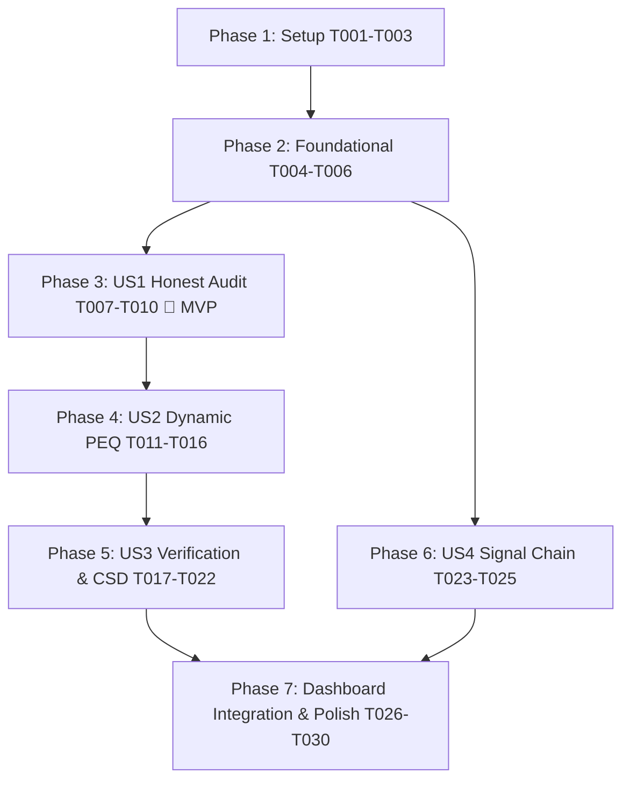

---

description: "Task list for comprehensive acoustic engine audit, real optimization refactor, and honest verification pipeline"
---

# Tasks: Comprehensive Acoustic Engine Audit, Real Optimization Refactor, and Honest Verification Pipeline

**Input**: Design documents from `/specs/001-audit-refactor-measurements/`  
**Prerequisites**: plan.md (required), spec.md (required), research.md, data-model.md, contracts/, quickstart.md  
**Constitution**: Adheres strictly to `.specify/memory/constitution.md` (Principles I–V)

---

## Phase 1: Setup (Shared Infrastructure)

**Purpose**: Initialize directory layouts, calibration epoch storage, and test fixtures.
- [X] T001 Initialize epoch storage directory structure at `data/calibrations/epochs/` with `.gitkeep`
- [X] T002 [P] Implement base Calibration Epoch data models and JSON manifest parser in `scripts/calibration_epoch.py`
- [X] T003 [P] Configure pytest test runner and synthetic benchmark impulse response fixtures in `tests/conftest.py`

---

## Phase 2: Foundational (Blocking Prerequisites)

**Purpose**: Core hardware constraints, YNC XML transactions, and provenance validation.

**⚠️ CRITICAL**: Must complete before any User Story tasks can proceed.

- [X] T004 Implement Yamaha RX-V673 discrete parameter tables (28 center frequencies, 14 Q factors, 0.5 dB gain steps) in `scripts/peq_optimizer.py`
- [X] T005 [P] Implement atomic Write-Commit-Readback YNC XML transaction layer in `scripts/04_yamaha_control.py`
- [X] T006 [P] Implement acoustic transfer function loader and provenance tag validator (`REAL_MEASUREMENT` vs `THEORETICAL_TARGET`) in `scripts/calibration_epoch.py`

**Checkpoint**: Foundation ready - User Story implementation can now proceed.

---

## Phase 3: User Story 1 - Honest & Verifiable Acoustic Measurement Audit (Priority: P1) 🎯 MVP

**Goal**: Eradicate all synthetic fallback calculations (`measurement + filter_curve`), ensure honest curve provenance, and enforce immutable epoch storage.

**Independent Test**: Run verification on raw impulse responses with altered acoustic peaks; verify zero static fallback curves are emitted and all provenance headers are authenticated.
- [X] T007 [P] [US1] Unit test for measurement provenance and synthetic curve rejection in `tests/test_calibration_epoch.py`

### Implementation for User Story 1
- [X] T008 [US1] Remove fake arithmetic curve addition fallback (`measurement + peq_model`) across `scripts/verify_calibration.py`
- [X] T009 [P] [US1] Eliminate hardcoded fallback filter tables from `scripts/auto_calibrate.py`
- [X] T010 [US1] Implement immutable epoch snapshot creation (`iter_0_baseline`, `iter_1_peq`, etc.) with SHA-256 impulse hashing in `scripts/calibration_epoch.py`

---

## Phase 4: User Story 2 - True Electroacoustic Parametric EQ Optimization (Priority: P2)

**Goal**: Dynamically compute 7-band discrete PEQ filters per channel ($f_{0,L} \neq f_{0,R}$) targeting real room resonances, with 80% Sweet Spot / 20% spatial average weighting and asymmetric gain limits.

**Independent Test**: Run optimizer on baseline room response; verify continuous fit snaps to discrete Yamaha limits, boost $\le +3.0\text{ dB}$, 0 dB boost above 500 Hz, and runtime $< 3\text{ s}$ per channel.

- [X] T011 [P] [US2] Unit and property tests for discrete parameter snapping and gain clamping in `tests/test_peq_optimizer.py`
- [X] T012 [P] [US2] Benchmark test for mathematical convergence in < 3 seconds per channel in `tests/test_peq_optimizer.py`

### Implementation for User Story 2
- [X] T013 [US2] Implement Stage 1 modal resonance detection with logarithmic derivative and prominence filtering in `scripts/peq_optimizer.py`
- [X] T014 [US2] Implement Stage 2 continuous biquad non-linear least squares (SLSQP) curve fitting in `scripts/peq_optimizer.py`
- [X] T015 [US2] Implement Stage 3 discrete parameter quantization and coordinate descent retuning in `scripts/peq_optimizer.py`
- [X] T016 [US2] Implement channel-independent dual-channel optimization ($f_{0,L} \neq f_{0,R}$) with 80/20 Sweet Spot weighting in `scripts/peq_optimizer.py`
---

## Phase 5: User Story 3 - Honest Post-Calibration Verification & Multi-Metric S-TIER Audit (Priority: P3)

**Goal**: Validate live physical sweeps against strict S-TIER gates ($\ge 6.0\text{ dB}$ modal cut, $< 2.5\text{ dB}$ RMS error, $< 2.0\text{ dB}$ stereo imbalance) and generate complete technical audit report with 3D CSD waterfall and NVRAM register dump.

**Independent Test**: Generate audit report for an epoch; verify CSD waterfall renders ringing decay under 300 Hz, register dump is verified via YNC, and S-TIER badge is withheld on failing thresholds.
- [X] T017 [P] [US3] Unit test for CSD waterfall STFT computation in `tests/test_csd_waterfall.py`
- [X] T018 [P] [US3] Unit test for strict multi-metric S-TIER certification gating in `tests/test_verify_calibration.py`

### Implementation for User Story 3
- [X] T019 [US3] Implement 3D Cumulative Spectral Decay (CSD) STFT analyzer for modal ringing in `scripts/csd_waterfall.py`
- [X] T020 [US3] Refactor verification metrics calculation in `scripts/verify_calibration.py` to enforce strict scientific formulations without arbitrary multipliers
- [X] T021 [US3] Implement hardware register dump extraction and verification in `scripts/verify_calibration.py`
- [X] T022 [US3] Implement technical audit report generator (HTML/SVG with 1/24-octave magnitude, CSD waterfall, NVRAM dump, and epoch delta table) in `scripts/verify_calibration.py`

---

## Phase 6: User Story 4 - Physically Accurate Audio Signal Chain & Routing (Priority: P4)

**Goal**: Ensure physical audio sweeps route through V-AUX at reference volume (-25 dBFS), validate anti-clipping (-24 dBFS to -3 dBFS), and enforce SNR $\ge 14\text{ dB}$.

- [X] T023 [P] [US4] Unit test for signal level validation, anti-clipping, and SNR thresholds in `tests/test_measure_sweep.py`

### Implementation for User Story 4
- [X] T024 [US4] Enforce V-AUX input selection, -25 dBFS reference volume, and Through DSP mode in `scripts/01_measure_sweep.py`
- [X] T025 [US4] Implement pre-sweep level check and SNR verification abort logic in `scripts/01_measure_sweep.py`

---

## Phase 7: Polish & Dashboard Integration

- [X] T026 [P] [US1] Update `/api/optimize_peq` endpoint to invoke `peq_optimizer.py` Stage 1-3 in `scripts/web_calibration_server.py`
- [X] T027 [P] [US2] Update `/api/deploy_peq` with atomic YNC readback verification in `scripts/web_calibration_server.py`
- [X] T028 [P] [US3] Update `/api/run_epoch_verification` and `/api/epoch_history` in `scripts/web_calibration_server.py`
- [X] T029 [US3] Update web UI dashboard templates and telemetry status displays in `scripts/web_calibration_server.py`
- [X] T030 Execute end-to-end automated validation suite in `tests/`

### Parallel Opportunities

- **Setup Phase**: `T002` (Epoch parser) and `T003` (pytest fixtures) can execute concurrently.
- **Foundational Phase**: `T005` (YNC XML transaction) and `T006` (Transfer function loader) can execute concurrently.
- **User Story 1**: `T007` (Unit test) and `T009` (Eliminate fallback tables) can run concurrently.
- **User Story 2**: `T011` (Snapping test) and `T012` (Benchmark test) can run concurrently.
- **User Story 3**: `T017` (CSD unit test) and `T018` (S-TIER gate test) can run concurrently.
- **User Story 4**: `T023` (Signal level test) can run concurrently with other test suites.
- **Polish Phase**: `T026`, `T027`, and `T028` (API endpoints) can be updated concurrently before final dashboard wiring in `T029`.

---

## Implementation Strategy

1. **MVP First (User Story 1)**: Complete Phases 1, 2, and 3. This immediately stops the emission of simulated and faked curves across the codebase, establishing clean measurement immutability.
2. **Core Algorithmic Upgrade (User Story 2)**: Implement the dynamic discrete PEQ optimizer. Validated with benchmark tests running under 3 seconds per channel.
3. **Comprehensive Audit Reporting (User Story 3)**: Implement 3D CSD waterfall analysis, NVRAM register dump verification, and strict S-TIER certification gating.
4. **Physical Hardware Hardening (User Story 4)**: Finalize safe reference sweep playback and anti-clipping safeguards.
5. **System Integration (Polish Phase)**: Connect endpoints, update web dashboard, and run the complete < 10 second validation suite.
