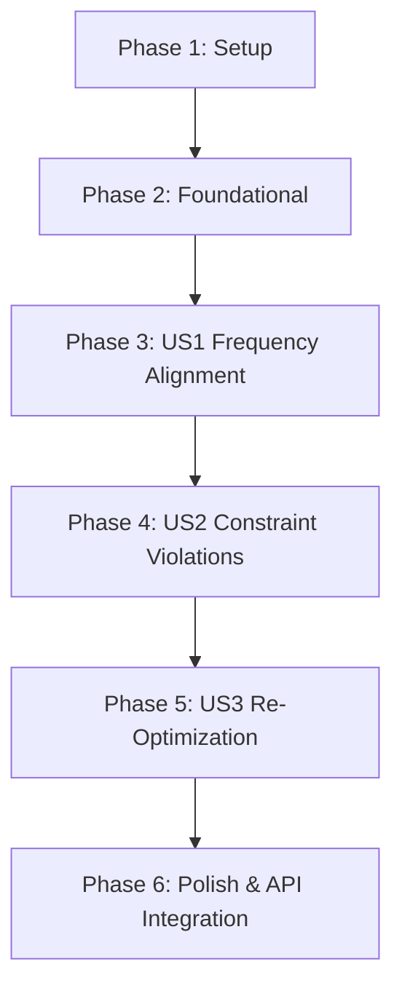

# Tasks: Audit and Verification of PEQ Filter Calculations

**Input**: Design documents from `specs/002-audit-peq-filters/`
**Prerequisites**: `plan.md`, `spec.md`, `research.md`, `data-model.md`, `contracts/audit_api_contract.md`, `quickstart.md`

## Phase 1: Setup & Data Fixtures

**Goal**: Establish test fixtures and baseline data structures for acoustic filter auditing.

- [ ] T001 [P] Create synthetic and empirical audit test fixtures in `tests/test_audit_peq.py`
- [ ] T002 Implement data classes for `ParametricFilterBand`, `RoomResonanceMode`, and `FilterAuditDiagnosis` in `scripts/audit_peq_filters.py`

---

## Phase 2: Foundational Components

**Goal**: Implement core mathematical utilities for composite acoustic weighting and peak matching.

- [ ] T003 Implement 80/20 composite acoustic baseline loader (80% Sweet Spot + 20% Spatial Average) in `scripts/audit_peq_filters.py`
- [ ] T004 [P] Implement discrete Yamaha parameter grid validation helper for $f_0$, $Q$, and gain in `scripts/audit_peq_filters.py`

---

## Phase 3: User Story 1 - Diagnostic Audit of Active PEQ Filters (Priority: P1)

**Goal**: Evaluate center frequency alignment of deployed PEQ filters against physical room resonance peaks (< 500 Hz).
**Independent Test**: Run audit on baseline measurement; confirm report identifies peak frequencies and flags misalignments > 5 Hz.

- [ ] T005 [P] [US1] Unit test for resonance peak detection and filter frequency alignment in `tests/test_audit_peq.py`
- [ ] T006 [US1] Implement room resonance peak detection algorithm for composite transfer function in `scripts/audit_peq_filters.py`
- [ ] T007 [US1] Implement filter-to-mode discrepancy calculation (flagging $\Delta f > 5.0\text{ Hz}$) in `scripts/audit_peq_filters.py`
- [ ] T008 [US1] Implement core diagnostic audit engine and evaluation verdict generator in `scripts/audit_peq_filters.py`

---

## Phase 4: User Story 2 - Detection of Mathematical and Hardware Violations (Priority: P2)

**Goal**: Detect invalid parameter configurations including positive modal gain, invalid discrete values, and gain clipping.
**Independent Test**: Supply flawed filter matrices (positive boost, non-discrete values); confirm 100% detection rate.

- [ ] T009 [P] [US2] Unit test for positive modal gain rejection and discrete grid violations in `tests/test_audit_peq.py`
- [ ] T010 [US2] Implement constraint audit rules (clamp check, modal boost rejection, discrete grid check) in `scripts/audit_peq_filters.py`
- [ ] T011 [US2] Implement non-modal band acoustic role verification (> 500 Hz speaker crossover check) in `scripts/audit_peq_filters.py`

---

## Phase 5: User Story 3 - Automated Re-Optimization and Observable Comparison (Priority: P3)

**Goal**: Provide automated re-optimization and comparative metrics when filters are diagnosed as suboptimal.
**Independent Test**: Pass suboptimal filter set with `--reoptimize`; verify generated replacement achieves $\ge 15\%$ RMS improvement.

- [ ] T012 [P] [US3] Unit test for automated re-optimization and residual RMS reduction in `tests/test_audit_peq.py`
- [ ] T013 [US3] Integrate `scripts/peq_optimizer.py` solver to calculate optimal replacement matrix in `scripts/audit_peq_filters.py`
- [ ] T014 [US3] Implement side-by-side comparative metrics calculation (modal attenuation, stereo balance, RMS error) in `scripts/audit_peq_filters.py`

---

## Phase 6: Polish & Integration

**Goal**: Wire CLI options and HTTP REST API endpoints into the running calibration server.

- [ ] T015 [P] Implement CLI argument parser and terminal formatting with colored diagnostic tables in `scripts/audit_peq_filters.py`
- [ ] T016 Implement `/api/audit_peq` POST endpoint in `scripts/web_calibration_server.py`
- [ ] T017 Execute end-to-end automated test suite for audit CLI and API in `tests/test_audit_peq.py`

---

## Dependencies & Execution Order

### Parallel Execution Opportunities
- `T001` (tests fixture) and `T002` (data classes) can be authored in parallel.
- `T004` (discrete grid validator) can run in parallel with `T003` (composite baseline loader).
- `T005`, `T009`, and `T012` unit test tasks can be developed concurrently before their respective implementations.
- `T015` (CLI formatting) and `T016` (Web server endpoint) can be implemented in parallel.

### Implementation Strategy
1. **MVP (Phase 1 to 3)**: Complete `audit_peq_filters.py` to analyze physical frequency alignment (User Story 1).
2. **Hardened Verification (Phase 4)**: Add constraint checking for positive modal boost and discrete grid validation (User Story 2).
3. **Automated Healing (Phase 5)**: Add `--reoptimize` to calculate and display the optimal replacement matrix (User Story 3).
4. **Full Integration (Phase 6)**: Expose via `/api/audit_peq` and verify with end-to-end test suite.
