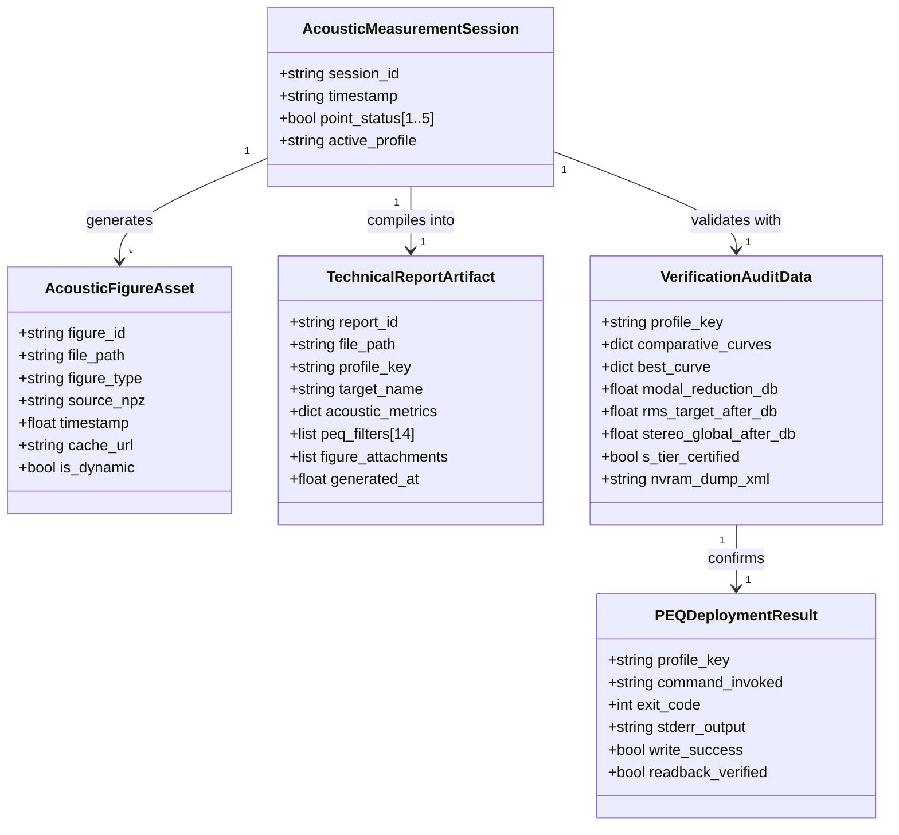

# Phase 1 Data Model: Dynamic Synchronization of Reports, Acoustic Figures, and Hardware PEQ Execution

**Feature**: `003-fix-report-graphs`
**Date**: 2026-09-03
**Status**: Completed

## Entities and Relationships

---

## Entity Definitions

### 1. AcousticFigureAsset
Represents an image asset dynamically generated by the acoustic signal processing pipeline.

- **Attributes**:
  - `figure_id` (string): Canonical identifier (`promedio_espacial`, `respuesta_acustica`, `waterfall_csd`, `rt60_decay`, `verificacion_post`).
  - `file_path` (string): Absolute/relative path in `figures/` directory.
  - `figure_type` (enum): `SPATIAL_AVERAGE`, `FREQUENCY_RESPONSE`, `WATERFALL_CSD`, `RT60_DECAY`, `VERIFICATION_COMPARISON`.
  - `source_npz` (string): Source `.npz` file used to compute the plot (e.g. `data/medicion_punto_1.npz` for CSD and RT60; `data/medicion_promedio_espacial.npz` for spatial average).
  - `timestamp` (float): Unix epoch timestamp of creation/modification.
  - `cache_url` (string): URL path with dynamic cache-busting token (e.g. `/figures/waterfall_csd_comparison.png?t=1725398400`).
  - `is_dynamic` (boolean): Invariant flag (`True`); legacy static plots are prohibited.
- **Validation Rules**:
  - `WATERFALL_CSD` MUST NOT have all-zero matrix values; the peak impulse magnitude in `source_npz` MUST exceed `1e-4`.
  - Modification timestamp MUST be within $\pm 10$ seconds of the measurement pipeline execution.

---

### 2. TechnicalReportArtifact
Encapsulates the official engineering PDF report generated for the user.

- **Attributes**:
  - `report_id` (string): Unique identifier (e.g. `Informe_Calibracion_Acustica_Yamaha_harman_wide_room.pdf`).
  - `file_path` (string): Canonical storage path in `reports/` and downloadable at `/api/download_pdf`.
  - `profile_key` (string): Active community target key (`harman_wide_room`, `bk_1974`, `dirac_live`, `cinema_blockbuster`, `pure_vocal_clarity`, `audiophile_flat`).
  - `target_name` (string): Display name of acoustic target (e.g. "Harman Target / Dr. Floyd Toole").
  - `acoustic_metrics` (dictionary): Computed room metrics:
    - `modal_peak_freq_hz` (float)
    - `modal_attenuation_db` (float)
    - `rms_error_before_db` (float)
    - `rms_error_after_db` (float)
    - `stereo_imbalance_db` (float)
  - `peq_filters` (list[14]): 7 bands Front L + 7 bands Front R (Freq, Gain, Q).
  - `figure_attachments` (list[string]): File paths to embedded PNG figures.
  - `generated_at` (float): Epoch timestamp of report compilation.
- **Validation Rules**:
  - Report MUST dynamically link the active profile; hardcoded profile strings are prohibited.
  - All metrics in the report MUST match the numerical values in `VerificationAuditData` (0.00 dB discrepancy).

---

### 3. VerificationAuditData
Structure containing the empirical multi-mode acoustic comparison and S-TIER certification criteria.

- **Attributes**:
  - `profile_key` (string): Scoped profile key.
  - `comparative_curves` (list[dict]): Multi-mode curve metrics (`Through`, `YPAO Flat`, `YPAO Front`, `YPAO Natural`, `PEQ Manual`).
  - `best_curve` (string): Winning curve identified by objective acoustic score.
  - `modal_reduction_db` (float): Reduction of primary room resonance ($\ge 6.0\text{ dB}$ for S-TIER).
  - `rms_target_after_db` (float): Deviation from target curve in 60-500 Hz range ($< 2.5\text{ dB}$ for S-TIER).
  - `stereo_global_after_db` (float): Inter-channel magnitude imbalance ($< 2.0\text{ dB}$ for S-TIER).
  - `s_tier_certified` (boolean): `True` if all three thresholds are satisfied.
  - `nvram_dump_xml` (string): Verified hardware register dump from Yamaha YNC API.

---

### 4. PEQDeploymentResult
Outcome of a hardware parameter write operation.

- **Attributes**:
  - `profile_key` (string): Profile deployed.
  - `command_invoked` (string): Exact CLI or API call executed.
  - `exit_code` (int): Process exit status (`0` = success).
  - `stderr_output` (string): Captured standard error stream (empty on clean run, diagnostic text on error).
  - `write_success` (boolean): `True` if YNC returned `PutParam="OK"`.
  - `readback_verified` (boolean): `True` if readback query matches written biquads.
