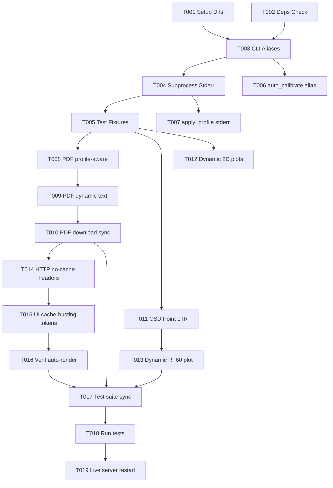

# Tasks: Dynamic Synchronization of Reports, Acoustic Figures, and Hardware PEQ Execution

**Input**: Design documents from `/specs/003-fix-report-graphs/`
**Prerequisites**: `plan.md`, `spec.md`, `research.md`, `data-model.md`, `contracts/api_contracts.md`, `quickstart.md`
**Status**: Ready for Implementation

---

## Phase 1: Setup

- [X] T001 Verify directory structure and write permissions for `reports/`, `figures/`, and `data/` in `scripts/web_calibration_server.py`
- [X] T002 [P] Verify Python numerical dependencies (`numpy`, `scipy`, `matplotlib`, `reportlab`) in environment via `tests/test_audit_peq.py`

---

## Phase 2: Foundational

- [X] T003 Implement CLI argument aliasing supporting `--profile` and `--target` interchangeably in `scripts/auto_calibrate.py`
- [X] T004 Implement robust subprocess error handling with complete `stderr` stream capture in `scripts/web_calibration_server.py`
- [X] T005 [P] Create test fixture and baseline validation helpers in `tests/test_report_graphs_sync.py`

---

## Phase 3: User Story 1 - Real-Time Dynamic & Profile-Aware PDF Report Generation (Priority: P1)

**Goal**: Ensure that PDF reports dynamically reflect the active acoustic profile, correct timestamps, and actual PEQ biquads, and that PEQ application executes without argument errors.

**Independent Test**: Execute `python3 scripts/auto_calibrate.py --target harman_wide_room` and compile PDF reports for two distinct profiles (`harman_wide_room` and `bk_1974`). Both commands succeed without exit code 2, and the resulting PDFs reflect their respective target curves and numerical metrics.

- [X] T006 [US1] Update `scripts/auto_calibrate.py` to accept `--target` and `--profile` as parameter aliases with default `harman_wide_room`
- [X] T007 [US1] Update `/api/apply_profile` endpoint in `scripts/web_calibration_server.py` to catch `subprocess.CalledProcessError`, return detailed `stderr`, and confirm YNC readback
- [X] T008 [P] [US1] Refactor `scripts/03_generate_pdf_report.py` to accept `--profile` / `--target` and dynamically load target curves and descriptions from `config/targets.json`
- [X] T009 [US1] Make narrative text and modal diagnostic peak values in `scripts/03_generate_pdf_report.py` dynamically computed from acoustic data
- [X] T010 [US1] Synchronize canonical output file path between `scripts/03_generate_pdf_report.py`, `/api/download_pdf`, and `/api/finalize_calibration` in `scripts/web_calibration_server.py`

---

## Phase 4: User Story 2 - Dynamic Acoustic Figures & Elimination of Stale Plots (Priority: P2)

**Goal**: Guarantee that all displayed graphs (Spatial Average, L/R Response, 3D Waterfall CSD, and RT60 Decay) are dynamically generated from current session data without zeroed arrays or browser cache staleness.

**Independent Test**: Execute `python3 scripts/csd_waterfall.py` and inspect `figures/waterfall_csd_comparison.png`. The plot shows non-zero resonant decay slices sourced from Punto 1 (Sweet Spot). Query `/figures/*` via HTTP and verify that responses include strict anti-caching headers.

- [X] T011 [P] [US2] Update `scripts/csd_waterfall.py` to source physical impulse response from Punto 1 (`data/medicion_punto_1.npz` or `data/medicion_real_calibracion.npz`) and ensure non-zero decay matrix
- [X] T012 [P] [US2] Ensure `scripts/02_plot_responses.py` dynamically calculates and saves `figures/respuesta_acustica_real.png` and `figures/promedio_espacial_multipunto.png`
- [X] T013 [P] [US2] Implement dynamic reverberation and impulse decay calculation in `scripts/02_plot_responses.py` (or `scripts/csd_waterfall.py`) saving dynamically to `figures/rt60_decay_analysis.png`
- [X] T014 [US2] Add strict HTTP anti-caching headers (`Cache-Control: no-cache, no-store, must-revalidate, max-age=0`, `Pragma: no-cache`) to all figure, report, and PDF routes in `scripts/web_calibration_server.py`
- [X] T015 [US2] Update web dashboard HTML templates in `scripts/web_calibration_server.py` to append dynamic timestamp query tokens (`?t=${Date.now()}`) to all figure `` tags and report links

---

## Phase 5: User Story 3 - Verification Audit Unification & Automated Test Suite (Priority: P3)

**Goal**: Provide consistent verification comparison results across web UI and downloadable audit reports, backed by an automated regression test suite.

**Independent Test**: Run `pytest tests/test_report_graphs_sync.py`. All tests pass, proving argument compatibility, non-zero CSD waterfall, profile-aware PDF generation, and HTTP anti-cache headers.

- [X] T016 [US3] Update `scripts/web_calibration_server.py` to automatically load and render multi-mode verification comparison metrics upon page load if data exists for the active profile
- [X] T017 [US3] Implement comprehensive automated test suite `tests/test_report_graphs_sync.py` covering CLI aliases, non-zero CSD matrix, dynamic PDF generation, and HTTP cache headers

---

## Phase 6: Polish & Cross-Cutting Concerns

- [X] T018 Execute automated test suite with `pytest tests/test_report_graphs_sync.py` and verify 100% pass rate
- [X] T019 Restart background calibration web server (`scripts/web_calibration_server.py`) and perform end-to-end smoke test on port 53317

---

## Dependencies & Execution Order

---

## Parallel Execution Opportunities

- **Pair 1**: `T008` (PDF profile generator) and `T011` (CSD waterfall Point 1) can be developed concurrently (different files: `03_generate_pdf_report.py` vs `csd_waterfall.py`).
- **Pair 2**: `T012` (2D plots) and `T014` (HTTP headers in server) can be developed concurrently.

---

## Implementation Strategy & MVP Scope

- **MVP Scope**: Complete Phase 1 through Phase 3 (User Story 1: T001 to T010). This immediately eliminates the `exit status 2` error on applying PEQ and provides profile-synchronized PDF reports.
- **Incremental Delivery**:
  1. Fix PEQ `--target` argument crash and add `stderr` visibility.
  2. Fix Waterfall CSD 0-value bug by sourcing Punto 1 IR.
  3. Refactor PDF generation to be profile-aware and dynamic.
  4. Enforce HTTP anti-cache headers.
  5. Validate with automated test suite `tests/test_report_graphs_sync.py`.
