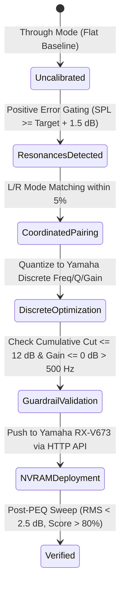

# Data Model: Acoustic PEQ Parameter Calculation & Verification Engine

**Feature**: `004-fix-peq-calculation`
**Date**: 2026-09-03
**Status**: Complete

## 1. Core Entities & Schemas

### 1.1 `ModalPeak`
Represents an acoustically verified room resonance peak exceeding the target curve.

| Field | Type | Constraints | Description |
|---|---|---|---|
| `freq_hz` | `float` | $30.0 \le f \le 500.0$ | Exact center frequency of the resonance peak |
| `elevation_db` | `float` | $\ge +1.5\text{ dB}$ | Peak sound pressure level above the target curve |
| `bandwidth_hz` | `float` | $> 0.0\text{ Hz}$ | Physical $-3.0\text{ dB}$ bandwidth in Hertz |
| `q_factor` | `float` | $0.500 \le Q \le 10.080$ | Calculated acoustic quality factor ($f_0 / \Delta f$) |
| `is_common_mode` | `bool` | `True` / `False` | True if detected in both Left and Right within $\pm 5\%$ |
| `channel` | `str` | `"left"` \| `"right"` \| `"common"` | Channel designation |

### 1.2 `PEQFilterBand`
Represents a single discrete parametric biquad peaking filter constrained to the Yamaha RX-V673 DSP specifications.

| Field | Type | Constraints | Description |
|---|---|---|---|
| `band` | `int` | $1 \le \text{band} \le 7$ | Band slot number (1 to 7) |
| `freq_hz` | `float` | Member of `YAMAHA_FREQS` | Discrete center frequency in Hertz |
| `q` | `float` | Member of `YAMAHA_QS` | Discrete Q factor ($0.500$ to $10.080$) |
| `gain_db` | `float` | $-12.0 \le \text{gain} \le +3.0$ (step $0.5$) | Filter gain in dB. Max $+0.0\text{ dB}$ if $f > 500\text{ Hz}$ |
| `role` | `str` | `"modal_cut"` \| `"voicing"` \| `"inactive"` | Acoustic role of the filter |

### 1.3 `ChannelPEQProfile`
Represents the complete 7-band equalization parameter set for a single channel.

| Field | Type | Constraints | Description |
|---|---|---|---|
| `channel` | `str` | `"left"` \| `"right"` | Target audio channel |
| `bands` | `List[PEQFilterBand]` | `len(bands) == 7` | Exactly 7 discrete parametric bands |
| `total_negative_gain_db`| `float` | $\ge -30.0\text{ dB}$ | Sum of all negative cuts (guardrail against hollowing) |
| `max_single_cut_db` | `float` | $\ge -12.0\text{ dB}$ | Deepest single attenuation filter |

### 1.4 `StereoOptimizationPlan`
Output of the dual-channel coordinated optimization engine.

| Field | Type | Constraints | Description |
|---|---|---|---|
| `profile_key` | `str` | e.g. `"harman_wide_room"` | Target curve profile identifier |
| `channels` | `Dict[str, List[PEQFilterBand]]` | `"left"`, `"right"` | Left and Right 7-band filter sets |
| `common_modes` | `List[Dict]` | — | Paired resonant modes corrected symmetrically |
| `metrics` | `Dict[str, float]` | — | Execution metrics: RMS reduction, modal attenuation |

### 1.5 `AcousticVerificationResult`
Verification metrics evaluated on post-calibration physical or simulated sweeps.

| Field | Type | Validation Rule | Description |
|---|---|---|---|
| `target_alignment_pct` | `float` | $0.0 \le \text{score} \le 100.0$ | Primary target adherence percentage |
| `fidelity_score_pct` | `float` | Identical to `target_alignment_pct` | Dual-key alias for UI compatibility |
| `rms_after_db` | `float` | $< 2.5\text{ dB}$ for S-TIER | Residual RMS error in $30\text{ Hz} - 500\text{ Hz}$ |
| `modal_reduction_db` | `float` | $\ge 6.0\text{ dB}$ for S-TIER | Attenuation achieved at the dominant room mode |
| `stereo_imbalance_db`| `float` | $< 2.0\text{ dB}$ for S-TIER | Mean absolute $|L - R|$ deviation |
| `s_tier_certified` | `bool` | `True` if all S-TIER criteria met | Strict certification gate status |
| `bass_suckout_detected` | `bool` | `True` if dip $> 4\text{ dB}$ in 60–200 Hz | Guardrail against over-attenuation |

---

## 2. State Transitions & Invariants

### Invariant Rules
1. **Zero-Cut on Dips**: $\forall f \text{ where } \text{SPL}(f) < \text{Target}(f) \implies \text{Gain}(f) = 0.0\text{ dB}$.
2. **Schroeder Ceiling**: $\forall f > 500.0\text{ Hz} \implies \text{Gain}(f) \le 0.0\text{ dB}$.
3. **Cumulative Depth**: $\forall f, \sum \text{Response}_k(f) \ge -12.0\text{ dB}$.
4. **Metric Symmetry**: `result['target_alignment_pct'] == result['fidelity_score_pct']`.
