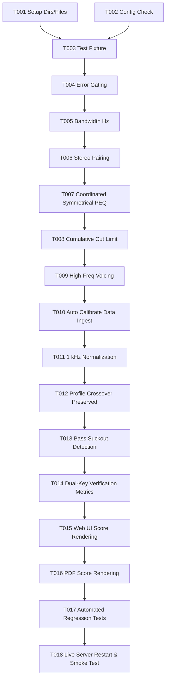

# Tasks: Acoustic PEQ Parameter Calculation Engine & Coordinated Stereo Optimization

**Input**: Design documents from `/specs/004-fix-peq-calculation/`
**Prerequisites**: `plan.md`, `spec.md`, `research.md`, `data-model.md`, `contracts/optimizer_contracts.md`, `quickstart.md`
**Status**: Ready for Implementation

---

## Phase 1: Setup (Shared Infrastructure)

**Purpose**: Verify input measurement data and target configuration schemas.

- [ ] T001 Verify empirical measurement files `data/medicion_punto_1.npz` and `data/medicion_promedio_espacial.npz` in `scripts/auto_calibrate.py`
- [ ] T002 [P] Verify target profile configurations and 7-band acoustic limits in `config/targets.json`

---

## Phase 2: Foundational (Blocking Prerequisites)

**Purpose**: Create test fixtures and core mathematical functions for peak detection and bandwidth estimation.

- [ ] T003 Create test fixture and unit tests for coordinated PEQ optimization in `tests/test_peq_optimizer_coordinated.py`
- [ ] T004 Implement positive error gating ($\Delta\text{SPL} \ge +1.5\text{ dB}$) in `detect_modal_resonances` in `scripts/peq_optimizer.py`
- [ ] T005 [P] Implement continuous frequency-domain bandwidth calculation ($\text{Hz}$) and discrete Q snapping in `scripts/peq_optimizer.py`

---

## Phase 3: User Story 1 - Acoustically Sound PEQ Optimization Engine (Priority: P1) 🎯 MVP

**Goal**: Ensure PEQ filters only cut true resonant peaks above target, calculate accurate Q factors, prevent dips from being cut, and coordinate shared room modes between L and R channels.

**Independent Test**: Execute `python3 -m unittest tests/test_peq_optimizer_coordinated.py` and verify all detected peaks have positive elevation, bandwidth in Hz, and shared ~115 Hz mode is addressed symmetrically without stacking high-Q cuts.

- [ ] T006 [US1] Implement `pair_stereo_modes` function for common resonance detection ($\pm 5\%$ frequency) in `scripts/peq_optimizer.py`
- [ ] T007 [US1] Refactor `optimize_channel_peq` to enforce coordinated symmetrical filters and limit asymmetric trims ($Q \le 3.5$, cut $\le -5.0\text{ dB}$) in `scripts/peq_optimizer.py`
- [ ] T008 [US1] Implement multi-filter composite biquad evaluation and cumulative attenuation limit ($\ge -12.0\text{ dB}$) in `scripts/peq_optimizer.py`
- [ ] T009 [US1] Enforce high-frequency voicing preservation (> 500 Hz) in `optimize_stereo_peq` in `scripts/peq_optimizer.py`

---

## Phase 4: User Story 2 - Consistent Reference Sourcing & Acoustic Normalization (Priority: P2)

**Goal**: Ensure calibration workflow sources canonical Sweet Spot and 5-point spatial average with consistent 1.0 kHz reference normalization.

**Independent Test**: Run `python3 scripts/auto_calibrate.py --profile harman_wide_room --dry-run` and verify it loads `medicion_punto_1.npz` and `medicion_promedio_espacial.npz`, normalizes at 1 kHz, and generates balanced PEQ tables.

- [ ] T010 [US2] Update `scripts/auto_calibrate.py` to authoritatively load `data/medicion_punto_1.npz` (Sweet Spot) and `data/medicion_promedio_espacial.npz`
- [ ] T011 [US2] Implement 1.0 kHz anchor level normalization for both sweet spot and spatial average responses in `scripts/auto_calibrate.py`
- [ ] T012 [US2] Pass target profile key and preserve 2.52 kHz crossover compensation filter into optimization flow in `scripts/auto_calibrate.py`

---

## Phase 5: User Story 3 - Post-Calibration Verification & Score Alignment (Priority: P3)

**Goal**: Ensure verification metrics validate convergence, detect artificial bass suckouts, and resolve the 0.0% score rendering bug across the web interface and PDF reports.

**Independent Test**: Run `python3 scripts/verify_calibration.py` and query `http://127.0.0.1:53317/api/verification_comparison`. Verify that `target_alignment_pct` and `fidelity_score_pct` are identical, non-zero numbers (> 50%), and display correctly in UI cards.

- [ ] T013 [US3] Add bass suckout detection ($> 4.0\text{ dB}$ dip below target in 60–200 Hz) to verification criteria in `scripts/verify_calibration.py`
- [ ] T014 [US3] Emit dual-key metrics (`target_alignment_pct` and `fidelity_score_pct`) with identical values in `scripts/verify_calibration.py`
- [ ] T015 [US3] Update JavaScript score extraction in `scripts/web_calibration_server.py` to evaluate `target_alignment_pct || fidelity_score_pct` across tables, badges, and verdicts
- [ ] T016 [US3] Synchronize dynamic PDF score extraction in `scripts/03_generate_pdf_report.py` to display positive fidelity percentages

---

## Phase 6: Polish & Cross-Cutting Concerns

**Purpose**: Regression testing, live web server restart, and end-to-end verification.

- [ ] T017 Execute full automated test suite `tests/test_peq_optimizer_coordinated.py` and `tests/test_report_graphs_sync.py` and verify 100% pass rate
- [ ] T018 Restart background calibration server `scripts/web_calibration_server.py` and perform end-to-end smoke test on port `53317`

---

## Dependencies & Execution Order

---

## Parallel Execution Opportunities

- **T001 & T002**: Data verification and config validation can run concurrently.
- **T004 & T005**: Error gating and physical bandwidth calculations touch distinct internal helper functions.
- **T015 & T016**: Web server JavaScript updates and PDF report generation script updates can run in parallel.

---

## Implementation Strategy

1. **MVP First (Phases 1–3)**: Build and test the mathematical optimization engine in `peq_optimizer.py`. Prove via unit test that false peak cuts on room dips are eliminated, bandwidth is computed in Hz, and shared room modes are addressed symmetrically.
2. **Integration (Phase 4)**: Wire the refined optimizer into `auto_calibrate.py`, ensuring consistent Sweet Spot sourcing and 1 kHz anchor normalization.
3. **Validation & UI (Phase 5)**: Update `verify_calibration.py` and `web_calibration_server.py` to fix the 0.0% score rendering bug and enforce bass suckout protection.
4. **Deliver & Prove (Phase 6)**: Run test suites and verify against the live server.
