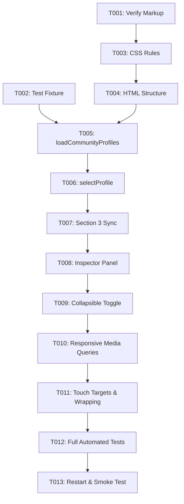

# Tasks: Compact Acoustic Profile Selector

**Input**: Design documents from `/specs/005-compact-profile-selector/`
**Prerequisites**: `plan.md`, `spec.md`, `research.md`, `data-model.md`, `contracts/ui_contracts.md`, `quickstart.md`
**Status**: Ready for Implementation

---

## Phase 1: Setup (Shared Infrastructure)

**Purpose**: Verify existing DOM structure and create automated testing harness.

- [ ] T001 Verify existing community profiles container and JavaScript functions in `scripts/web_calibration_server.py`
- [ ] T002 [P] Create automated DOM contract and regression test suite in `tests/test_compact_profile_selector.py`

---

## Phase 2: Foundational (Blocking Prerequisites)

**Purpose**: Establish base CSS classes and HTML component structure for the compact grid and inspector.

- [ ] T003 Implement CSS rules for `.compact-profiles-grid`, `.compact-profile-chip`, and `.profile-inspector` in `scripts/web_calibration_server.py`
- [ ] T004 Update HTML markup of `#community-profiles-panel` to include `#profiles-container` and `#profile-inspector-panel` in `scripts/web_calibration_server.py`

---

## Phase 3: User Story 1 - Compact Profile Grid and Direct Selection (Priority: P1) 🎯 MVP

**Goal**: Display all 9 profiles in a high-density compact grid (~240px tall) with 1-click local selection.

**Independent Test**: Load the dashboard, verify all 9 profiles are rendered as compact chips with badge, rank, and title, and clicking any chip immediately highlights it and updates Section 3 PEQ parameters in < 150ms without AVR writes.

- [ ] T005 [US1] Refactor `loadCommunityProfiles()` to dynamically render 9 `.compact-profile-chip` elements in `scripts/web_calibration_server.py`
- [ ] T006 [US1] Refactor `selectProfile(key)` to handle 1-click selection and `.active-target` class switching in `scripts/web_calibration_server.py`
- [ ] T007 [US1] Update `selectProfile(key)` to synchronize Section 3 PEQ table and PDF download link without sending hardware writes in `scripts/web_calibration_server.py`

---

## Phase 4: User Story 2 - Expandable Detail & Acoustic Backing on Demand (Priority: P2)

**Goal**: Provide full scientific research backing, description, pros, and cons in a shared inspector panel below the grid.

**Independent Test**: Select any profile chip and verify `#profile-inspector-panel` displays that profile's scientific backing, description, and pros/cons tags; verify collapsing minimizes vertical height.

- [ ] T008 [US2] Implement `updateProfileInspector(key)` to render active profile research, description, pros, and cons in `scripts/web_calibration_server.py`
- [ ] T009 [US2] Add collapsible toggle button and slide styling for `#profile-inspector-panel` in `scripts/web_calibration_server.py`

---

## Phase 5: User Story 3 - Responsive Viewport Adaptation (Priority: P3)

**Goal**: Ensure seamless layout reflow across desktop (3 columns), tablet (2 columns), and mobile (1 column) viewports.

**Independent Test**: Validate viewport reflow using automated assertions and browser device emulation at 1200px, 768px, and 375px with zero horizontal scroll.

- [ ] T010 [US3] Implement responsive CSS media queries for desktop, tablet, and mobile grid reflow in `scripts/web_calibration_server.py`
- [ ] T011 [US3] Enforce minimum touch target heights (>= 44px) and robust text wrapping for variable profile title lengths in `scripts/web_calibration_server.py`

---

## Phase 6: Polish & Cross-Cutting Concerns

**Purpose**: Complete regression test suite execution, server restart, and live verification.

- [ ] T012 Execute automated test suite in `tests/test_compact_profile_selector.py` and `tests/test_report_graphs_sync.py`
- [ ] T013 Restart calibration background server `scripts/web_calibration_server.py` and perform live smoke test on port 53317

---

## Dependencies & Execution Order

---

## Parallel Execution Opportunities

- **Phase 1**: `T001` and `T002` can execute in parallel.
- **Phase 2 & Phase 3**: Test assertions in `tests/test_compact_profile_selector.py` can be written while `T003`/`T004` CSS/HTML structure is laid out.

---

## Implementation Strategy

1. **MVP First (User Story 1)**: Deliver compact 3-column chip grid with direct selection. This immediately solves the primary issue (> 65% vertical height reduction).
2. **Detail Inspector (User Story 2)**: Add the shared active inspector directly beneath the grid to preserve deep acoustic context on demand.
3. **Responsive Polish (User Story 3)**: Tune media queries for mobile and tablet ergonomics.
4. **Deliver & Prove (Phase 6)**: Run test suite and verify on live server.
