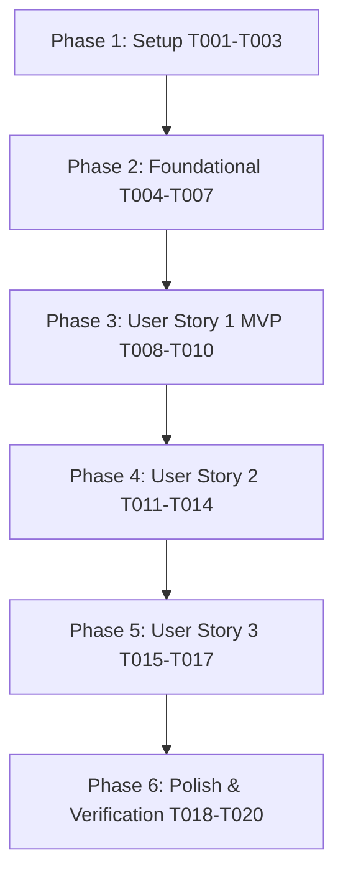

# Tasks: Tight Sweet-Spot Multipoint & Hardware Profile Calibration

**Input**: Design documents from `/specs/006-hardware-sweetspot-calibration/`
**Prerequisites**: `plan.md`, `spec.md`, `research.md`, `data-model.md`, `contracts/api_contracts.md`, `contracts/ui_contracts.md`, `quickstart.md`
**Status**: Ready for Implementation

---

## Phase 1: Setup (Shared Infrastructure)

**Purpose**: Initialize configuration files, calibration curve storage, and automated test harnesses.

- [ ] T001 Initialize persistent hardware profile schema in `config/hardware.json` matching data model
- [ ] T002 Create default 90° diffuse-field calibration files in `config/calibrations/` for supported microphones
- [ ] T003 [P] Create automated regression test suite in `tests/test_hardware_sweetspot_calibration.py`

---

## Phase 2: Foundational (Blocking Prerequisites)

**Purpose**: Implement the core mathematical processing: broadband normalization, REW Variable Smoothing, and hardware-bound optimizer constraints.

- [ ] T004 Implement REW-standard Variable Smoothing (Var) function in `scripts/peq_optimizer.py`
- [ ] T005 Implement broadband 300 Hz – 3 kHz logarithmic energy normalization and adaptive modal threshold in `scripts/peq_optimizer.py`
- [ ] T006 Implement dynamic hardware constraint ingestion from `config/hardware.json` in `scripts/peq_optimizer.py`
- [ ] T007 Update `run_calibration()` in `scripts/auto_calibrate.py` to use 70/30 tight sweet-spot weighting and broadband normalization

---

## Phase 3: User Story 1 (P1 MVP) - Tight Sweet-Spot Multipoint & Modal Calibration

**Goal**: Enable high-fidelity sweet-spot clustering (15–20 cm radius) with mandatory 90° vertical orientation and balanced Front L/R modal notch allocation.
**Independent Test**: Run `python3 scripts/auto_calibrate.py --profile harman_wide_room --dry-run` and verify Front L receives >= 2 active modal notch filters in 60–300 Hz with RMS error reduction >= 1.5 dB.

- [ ] T008 [US1] Add visual 5-point tight cluster diagram and 90° vertical orientation guidance in `scripts/web_calibration_server.py`
- [ ] T009 [US1] Update sweep acquisition in `scripts/web_calibration_server.py` to validate tight-cluster coordinates and store spatial metadata
- [ ] T010 [US1] Connect tight-cluster spatial calculation to `/api/apply_profile` pipeline in `scripts/web_calibration_server.py`

---

## Phase 4: User Story 2 (P2) - Hardware Selector: Mic, Amplifier & Speakers

**Goal**: Provide REST endpoints and dashboard UI for selecting equipment, loading custom `.cal` files, and documenting hardware in PDF reports.
**Independent Test**: Query `/api/hardware/config`, update via `/api/hardware/select`, verify persistence in `config/hardware.json`, and check that `scripts/generate_pdf_report.py` documents active equipment in Table 1.

- [ ] T011 [US2] Implement REST endpoints `/api/hardware/config`, `/api/hardware/select`, and `/api/hardware/upload_mic_cal` in `scripts/web_calibration_server.py`
- [ ] T012 [US2] Implement `#hardware-config-panel` HTML markup and CSS styling in `scripts/web_calibration_server.py`
- [ ] T013 [US2] Implement JavaScript hardware selection handlers and live status sync in `scripts/web_calibration_server.py`
- [ ] T014 [US2] Update `scripts/generate_pdf_report.py` Table 1 to dynamically render active microphone, amplifier, and speaker specifications

---

## Phase 5: User Story 3 (P3) - Real-Time Front L vs Front R Modal Symmetry Diagnostics

**Goal**: Provide side-by-side diagnostic visibility into detected room modes, Q values, and filter allocations for both channels.
**Independent Test**: Query `/api/calibration/modal_diagnostics` and verify side-by-side diagnostic card renders on the dashboard with clear reasoning for all 7 bands.

- [ ] T015 [US3] Implement `/api/calibration/modal_diagnostics` endpoint in `scripts/web_calibration_server.py` returning L/R peak metrics
- [ ] T016 [US3] Implement `#modal-symmetry-card` HTML markup and table rendering in `scripts/web_calibration_server.py`
- [ ] T017 [US3] Implement client-side JavaScript diagnostic update function in `scripts/web_calibration_server.py`

---

## Phase 6: Polish & Cross-Cutting Concerns

**Purpose**: Execute end-to-end regression testing, live server restart, and verification of non-destructive behavior.

- [ ] T018 Execute full test suite via `python3 -m unittest discover -s tests -p "test_*.py"`
- [ ] T019 Restart background calibration server `cal_server` on port 53317 and verify live HTTP endpoints
- [ ] T020 Verify Constitution Principles I–V (confirm zero unauthorized AVR state mutations on hardware switch)

---

## Dependencies & Execution Order

### User Story Dependencies

- **User Story 1 (P1 MVP)** depends on Foundational (Phase 2). Can be delivered as functional MVP.
- **User Story 2 (P2)** depends on Phase 2 & Phase 3. Adds equipment abstraction and PDF report integration.
- **User Story 3 (P3)** depends on Phase 2 & Phase 3. Adds diagnostic transparency.
- **Polish (Phase 6)** depends on all stories being implemented.

### Parallel Opportunities

- In Phase 1: `T003` (automated tests) can be implemented in parallel with `T001` and `T002`.
- In Phase 4: `T014` (PDF report integration) can be developed in parallel with UI tasks `T012` and `T013`.
- In Phase 5: `T015` (backend diagnostics) and `T016` (HTML markup) can be drafted concurrently.
