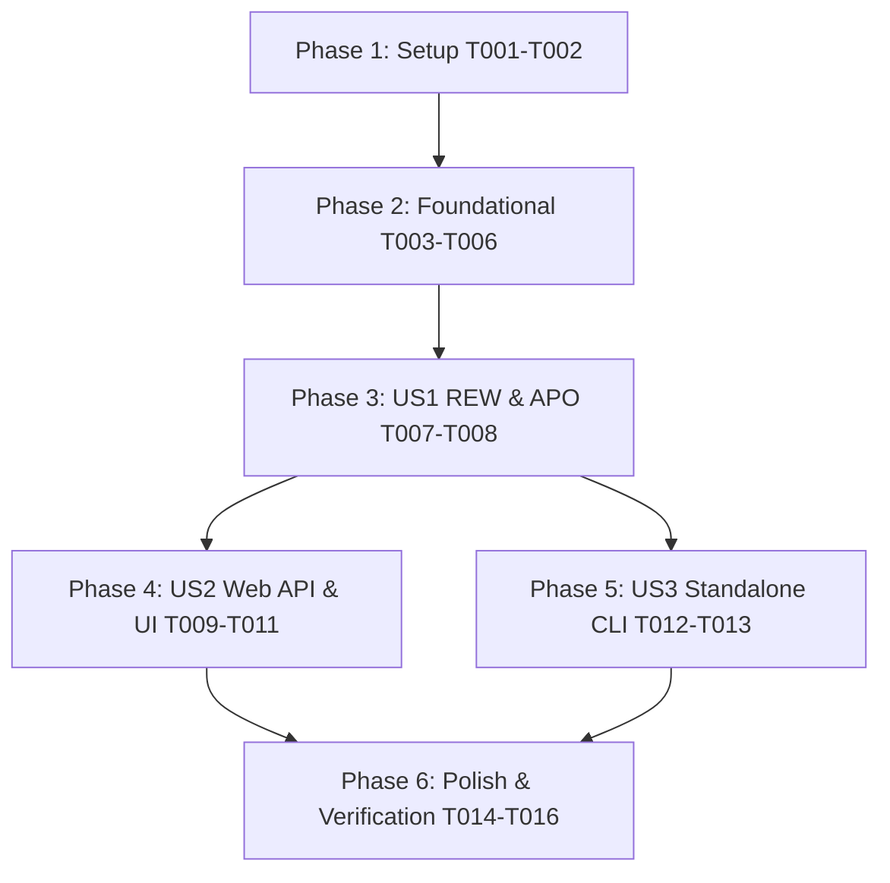

# Tasks: Multi-Format Filter Export (REW, EqualizerAPO, CSV)

**Input**: Design documents from `/specs/007-multi-format-filter-export/`
**Prerequisites**: `plan.md`, `spec.md`, `research.md`, `data-model.md`, `contracts/api_contracts.md`, `quickstart.md`
**Status**: Completed

---

## Phase 1: Setup (Shared Infrastructure)

**Purpose**: Initialize exports directory structure, test fixtures, and mock filter data.

- [X] T001 Initialize export artifact destination directory structure in `exports/`
- [X] T002 Create test harness and unit test suite in `tests/test_filter_export.py`

---

## Phase 2: Foundational (Blocking Prerequisites)

**Purpose**: Implement the core export formatting module and generator functions in `scripts/export_filters.py`.

- [X] T003 Implement `format_rew()` function producing standard Room EQ Wizard `.req` text for single channels in `scripts/export_filters.py`
- [X] T004 Implement `format_equalizer_apo()` function producing dual-channel config with automatic negative preamp calculation in `scripts/export_filters.py`
- [X] T005 Implement `format_csv()` function producing structured tabular CSV output with active hardware tags in `scripts/export_filters.py`
- [X] T006 Implement `build_export_bundle()` packaging all formats into in-memory dictionary and ZIP archive in `scripts/export_filters.py`

---

## Phase 3: User Story 1 (P1 MVP) - REW & EqualizerAPO Core Formatting

**Goal**: Deliver fully formatted `.req` (REW) and `.txt` (EqualizerAPO) filter definitions matching active Yamaha RX-V673 discrete register allocations.
**Independent Test**: Execute `scripts/export_filters.py` with mock/real filters; verify REW `.req` output contains Filter 1..7 lines conforming to REW spec and EqualizerAPO output has Channel L/R sections with calculated Preamp headroom.

- [X] T007 [US1] Wire active hardware profile (`config/hardware.json`) and target profile ingestion into `scripts/export_filters.py`
- [X] T008 [US1] Add automated unit tests for REW and EqualizerAPO formatting edge cases (inactive 0 dB bands, extreme Q factors) in `tests/test_filter_export.py`

---

## Phase 4: User Story 2 (P2) - Web Calibration Server Endpoints & Dashboard UI

**Goal**: Provide REST endpoint `GET /api/export_filters` and interactive `#export-filters-card` download buttons on the web calibration dashboard.
**Independent Test**: Query `GET /api/export_filters?format=csv&profile=harman_wide_room` on live server; verify `text/csv` response; verify dashboard renders download triggers updating with profile selector.

- [X] T009 [US2] Implement `GET /api/export_filters` endpoint supporting `format=rew`, `equalizerapo`, `csv`, and `all` in `scripts/web_calibration_server.py`
- [X] T010 [US2] Implement `#export-filters-card` HTML markup and CSS buttons in `scripts/web_calibration_server.py`
- [X] T011 [US2] Implement client-side JavaScript handlers to dynamically update export download URLs when the active profile changes in `scripts/web_calibration_server.py`

---

## Phase 5: User Story 3 (P3) - Standalone CLI Utility

**Goal**: Provide standalone CLI command `scripts/export_filters.py` for headless workflows and automated archiving.
**Independent Test**: Run `python3 scripts/export_filters.py --profile harman_wide_room --format all --out-dir exports/` and verify generated files exist and match web endpoint output.

- [X] T012 [US3] Implement CLI `argparse` entry point with `--profile`, `--format`, and `--out-dir` options in `scripts/export_filters.py`
- [X] T013 [US3] Add automated CLI execution test in `tests/test_filter_export.py`

---

## Phase 6: Polish & Cross-Cutting Concerns

**Purpose**: Verify end-to-end regression compliance, Constitution principles, and live server restart.

- [X] T014 Execute full project test suite via `python3 -m unittest discover -s tests -p "test_*.py"`
- [X] T015 Restart live calibration background service `cal_server` on port 53317 and verify export endpoints
- [X] T016 Verify Constitution Principles I–V (confirm export endpoints perform zero destructive writes on the AVR)

---

## Dependencies & Execution Order

