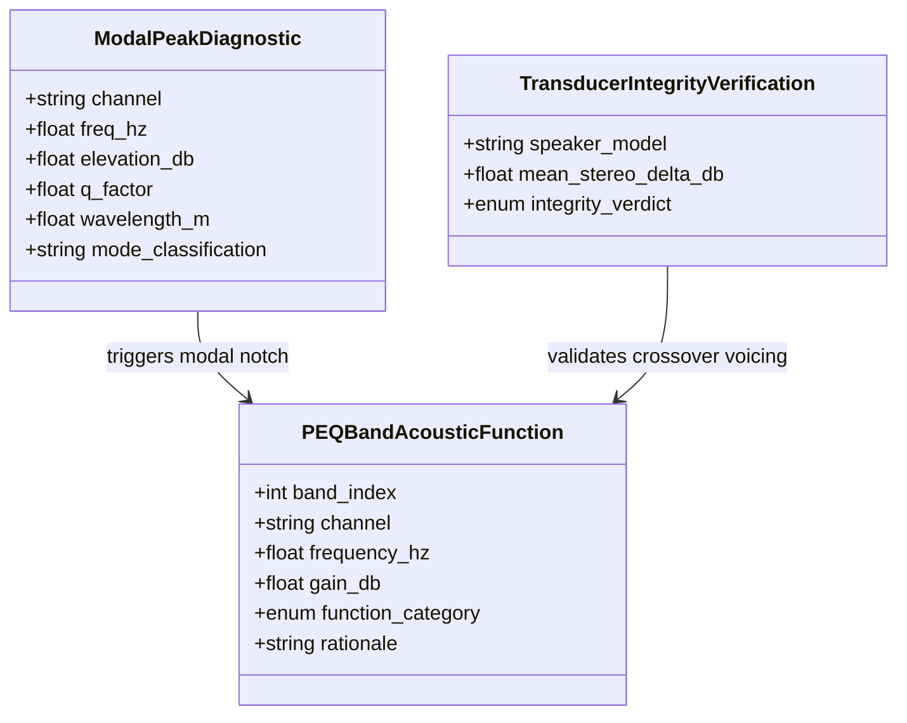

# Data Model: Modal Notch Diagnostic and Acoustic PEQ Rationale

## Entities

### 1. ModalPeakDiagnostic
Represents an empirically identified acoustic room mode peak.

| Field | Type | Description |
| :--- | :--- | :--- |
| `channel` | `string` | Channel identifier (`L` or `R`) |
| `freq_hz` | `float` | Exact measured center frequency (Hz) |
| `snapped_freq_hz` | `float` | Nearest supported discrete Yamaha PEQ frequency (Hz) |
| `elevation_db` | `float` | Peak height in dB above baseline |
| `prominence_db` | `float` | Isolated prominence in dB relative to neighboring valleys |
| `bandwidth_hz` | `float` | Half-power (-3 dB) bandwidth in Hz |
| `q_factor` | `float` | Quality factor ($f_0 / \Delta f$) |
| `snapped_q` | `float` | Nearest supported discrete Yamaha Q factor |
| `wavelength_m` | `float` | Acoustic wavelength $\lambda = 343 / f_0$ (meters) |
| `half_wavelength_m` | `float` | Room boundary distance $\lambda / 2$ (meters) |
| `mode_classification` | `string` | `AXIAL_ROOM_MODE`, `TANGENTIAL_ROOM_MODE`, or `BOUNDARY_REFLECTION` |

### 2. PEQBandAcousticFunction
Annotates each discrete hardware band with its physical and electroacoustic justification.

| Field | Type | Description |
| :--- | :--- | :--- |
| `band_index` | `int` | Hardware band number (1 to 7) |
| `channel` | `string` | Channel identifier (`L` or `R`) |
| `frequency_hz` | `float` | Center frequency (Hz) |
| `gain_db` | `float` | Discrete gain (-12.0 to +3.0 dB) |
| `q` | `float` | Discrete Q factor (0.5 to 10.08) |
| `function_category` | `enum` | `MODAL_NOTCH`, `CROSSOVER_VOICING`, `TRANSPARENT_PASS` |
| `rationale` | `string` | Human-readable explanation of why this setting was calculated |
| `phase_distortion_risk` | `string` | `NONE` (when 0.0 dB) or `MINIMAL_MINIMUM_PHASE_DRAIN` |

### 3. TransducerIntegrityVerification
Formal electroacoustic diagnostic report assessing speaker transducer health.

| Field | Type | Description |
| :--- | :--- | :--- |
| `speaker_model` | `string` | Target speaker identifier (e.g. `Q Acoustics 3020i`) |
| `evaluation_range_hz` | `string` | High-frequency anechoic window (400 Hz - 10,000 Hz) |
| `mean_stereo_delta_db` | `float` | Average absolute L vs R difference in mid/high band (< 0.5 dB = pristine) |
| `crossover_tracking_delta_db` | `float` | L vs R difference at crossover point (2.52 kHz) |
| `integrity_verdict` | `enum` | `PRISTINE_HEALTH`, `MINOR_ROOM_EFFECT`, `DRIVER_ANOMALY` |
| `verdict_notes` | `string` | Detailed technical verdict text |

### 4. CalibrationWizardStep
Represents an independent page/phase within the step-by-step calibration assistant.

| Field | Type | Description |
| :--- | :--- | :--- |
| `step_number` | `int` | Phase sequence number (1 to 6) |
| `step_id` | `string` | Unique identifier (`preflight`, `multipoint`, `optimizer`, `deploy`, `verification`, `reports`) |
| `title` | `string` | Human-readable title displayed in the wizard header |
| `status` | `enum` | `PENDING`, `IN_PROGRESS`, `COMPLETED`, `SKIPPED` |
| `is_navigable` | `bool` | True if the user can click directly to this step |
| `can_advance` | `bool` | True if the step's completion criteria are satisfied |

### 5. DynamicPEQOptimizationResult
Encapsulates the mathematical output of `optimize_stereo_peq()` on empirical measurement data.

| Field | Type | Description |
| :--- | :--- | :--- |
| `profile_key` | `string` | Active acoustic target profile (e.g. `harman_wide_room`) |
| `source_sweet_spot` | `string` | Path or hash of `medicion_punto_1.npz` |
| `source_spatial_avg` | `string` | Path or hash of `medicion_promedio_espacial.npz` |
| `channels` | `object` | Dictionary containing `left` (7 bands) and `right` (7 bands) |
| `predicted_rms_reduction_db` | `float` | Estimated error reduction against the target curve |
| `predicted_modal_attenuation_db` | `float` | Estimated peak room mode attenuation |
| `stereo_aligned` | `bool` | True if all bands share center frequencies or neutral 0.0 dB pairings |
| `timestamp` | `string` | ISO 8601 calculation timestamp |

## Relationships

