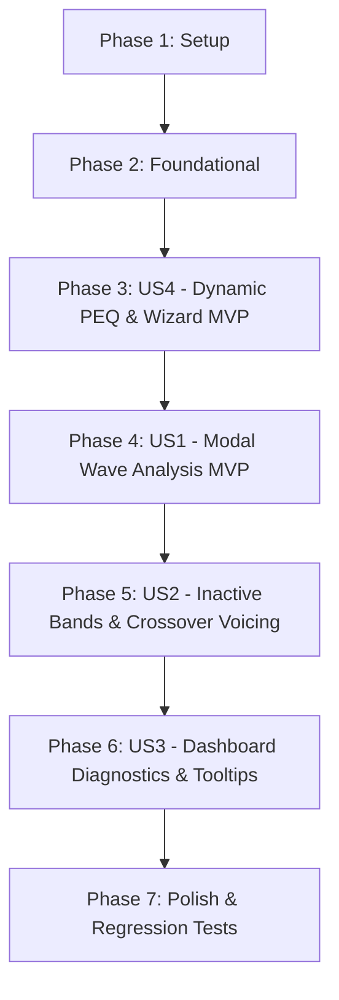

# Tasks: Modal Notch Diagnostic, Dynamic PEQ Synchronization, and Paginated Wizard Flow

**Input**: Design documents from `/specs/008-modal-notch-analysis/`
**Prerequisites**: `plan.md`, `spec.md`, `research.md`, `data-model.md`, `contracts/api_contracts.md`, `quickstart.md`

## Format: `[ID] [P?] [Story] Description`

- **[P]**: Can run in parallel (different files, no dependencies)
- **[Story]**: Which user story this task belongs to (US1, US2, US3, US4)
- Include exact file paths in descriptions

---

## Phase 1: Setup (Shared Infrastructure)

- [X] T001 Verify existing test fixtures, empirical data files in `data/`, and active community targets in `config/targets.json`

---

## Phase 2: Foundational (Blocking Prerequisites)
- [X] T002 Verify discrete Yamaha RX-V673 frequency and Q snapping arrays in `scripts/peq_optimizer.py` and create backup baseline for `config/targets.json`

**Checkpoint**: Foundation ready - user story implementation can begin.

---

## Phase 3: User Story 4 - Dynamic Empirical PEQ Calculation and Paginated Wizard Flow (Priority: P1 MVP) 🎯 MVP

**Goal**: Derive all 7 PEQ biquad filters per channel dynamically from empirical measurement data (`medicion_punto_1.npz` and `medicion_promedio_espacial.npz`), overwrite static tables in `config/targets.json` with coherent stereo band frequencies, and restructure the web UI into a paginated, step-by-step modular wizard allowing non-destructive single-point re-measurement.

**Independent Test**: Complete a 5-point measurement or finalize calibration; verify that `config/targets.json` active profile bands update with mathematically calculated values (zero static placeholders), that the web UI renders 6 navigable wizard steps, and that repeating Point 3 updates its measurement without wiping other points.

### Tests for User Story 4

- [ ] T003 [P] [US4] Create unit test in `tests/test_dynamic_peq_sync.py` verifying `optimize_stereo_peq()` outputs matching discrete frequencies for paired bands and updates `config/targets.json`
- [ ] T004 [P] [US4] Create integration test in `tests/test_wizard_navigation.py` verifying `/api/clear_point`, `/api/record_point`, and wizard step transition endpoints

### Implementation for User Story 4

- [ ] T005 [US4] Update `scripts/peq_optimizer.py` to enforce unique frequency allocation, eliminate duplicate snapped frequencies, and pair asymmetric modes with neutral 0.0 dB on opposite channel
- [ ] T006 [US4] Update `scripts/auto_calibrate.py` to persist the 7 calculated biquad bands into `config/targets.json` under the active profile key
- [ ] T007 [US4] Integrate dynamic PEQ optimization and `targets.json` synchronization into `/api/finalize_calibration` route in `scripts/web_calibration_server.py`
- [ ] T008 [US4] Add `/api/record_point` and `/api/clear_point` endpoints in `scripts/web_calibration_server.py` for non-destructive single-point re-measurement
- [X] T009 [US4] Implement modular paginated wizard UI structure (`#wizard-stepper`, `.wizard-page`, `#btn-wizard-prev`, `#btn-wizard-next`) in `scripts/web_calibration_server.py`
- [X] T010 [US4] Implement client-side step state management, breadcrumbs, and individual point re-measurement controls in `scripts/web_calibration_server.py`
- [X] T021 [US4] Relocate modal resonance diagnostic panel from Step 1 to Step 3 (Optimization & Profiles) in `scripts/web_calibration_server.py`
- [X] T022 [US4] Replace ASCII cluster diagram with modern SVG vector graphic showing coordinates and sweet spot weighting in `scripts/web_calibration_server.py`
- [X] T023 [US4] Enforce strict try/catch/finally error handling in client-side async routines to prevent mobile navigation freezes in `scripts/web_calibration_server.py`
**Checkpoint**: User Story 4 fully operational - calibration calculations are 100% dynamic and the interface is a navigable step-by-step wizard.

---

## Phase 4: User Story 1 - Physical Acoustic Analysis of Front L 125 Hz Room Mode vs Front R Asymmetry (Priority: P1 MVP)

**Goal**: Provide authoritative physical and mathematical analysis of the Front L 125 Hz axial room mode ($\lambda = 2.81\text{ m}$, $Q = 5.04$), explaining boundary interaction and stereo asymmetry.

**Independent Test**: Run diagnostic function on `data/medicion_promedio_espacial.npz`; verify it outputs $\lambda \approx 2.74\text{ - }2.86\text{ m}$, boundary distance $\approx 1.37\text{ - }1.43\text{ m}$, and verifies high-Q notch necessity.

### Tests for User Story 1

- [ ] T011 [P] [US1] Create unit test in `tests/test_modal_notch_diagnostic.py` validating wavelength equation ($\lambda = 343 / f$) and Q factor calculation from measured resonance peaks

### Implementation for User Story 1

- [ ] T012 [US1] Implement physical wavelength, half-wavelength boundary distance, and Q factor calculation functions in `scripts/peq_optimizer.py`
- [ ] T013 [US1] Implement `GET /api/calibration/modal_diagnostics` endpoint in `scripts/web_calibration_server.py` returning axial standing wave analysis for Front L and Front R

**Checkpoint**: User Story 1 fully operational - standing wave physics and stereo asymmetry are rigorously calculated and exposed via API.

---

## Phase 5: User Story 2 - Rationale for Inactive Bands (0.0 dB) and High-Frequency Voicing Boosts (Priority: P2)

**Goal**: Document and justify why unexcited PEQ bands remain at 0.0 dB (phase preservation / anti-boost) and why Band 6 applies a positive boost (+1.5 / +2.0 dB) at 2.52 kHz for Q Acoustics 3020i crossover dip compensation.

**Independent Test**: Query modal diagnostics and PDF generator; verify that each band includes its electroacoustic role annotation (`MODAL_NOTCH`, `CROSSOVER_VOICING`, `TRANSPARENT_PASS`).

### Tests for User Story 2

- [ ] T014 [P] [US2] Create unit test in `tests/test_peq_band_rationales.py` verifying band classification logic and crossover boost validation

### Implementation for User Story 2

- [ ] T015 [US2] Implement `classify_peq_band_function()` in `scripts/peq_optimizer.py` to annotate each band with its acoustic rationale and phase impact
- [ ] T016 [US2] Enrich PDF report generator `scripts/03_generate_pdf_report.py` with the electroacoustic rationale table explaining inactive bands and crossover voicing

**Checkpoint**: User Story 2 operational - all 7 bands have clear electroacoustic explanations in API and PDF reports.

---

## Phase 6: User Story 3 - Dashboard Modal Diagnostics & Educational Tooltips (Priority: P3)

**Goal**: Present modal diagnostics, standing wave physical dimensions, transducer health badges, and contextual tooltips in the web calibration dashboard.

**Independent Test**: Open `http://127.0.0.1:53317/`; verify modal symmetry card renders physical wavelength for 125 Hz and tooltips explain each band row in the PEQ table.

### Implementation for User Story 3

- [ ] T017 [P] [US3] Add `#modal-symmetry-card` component with L vs R standing wave analysis and transducer health indicator in `scripts/web_calibration_server.py`
- [ ] T018 [US3] Add explanatory badges and hover tooltips to the PEQ table rows in `scripts/web_calibration_server.py`

**Checkpoint**: User Story 3 operational - dashboard presents interactive educational tooltips and physical modal diagnostics.

---

## Phase 7: Polish & Cross-Cutting Concerns

**Purpose**: Regression testing, end-to-end flow validation, and documentation updates.

- [ ] T019 [P] Run full project unit and integration test suite via `python3 -m unittest discover -s tests -p "test_*.py"`
- [ ] T020 Update `specs/008-modal-notch-analysis/quickstart.md` with verified execution outputs and report links

---

## Dependencies & Execution Order

### Parallel Opportunities

- **Phase 3 (US4)**: T003 (unit tests) and T004 (integration tests) can run in parallel.
- **Phase 4 (US1)**: T011 (unit test) can run in parallel with US4 frontend work.
- **Phase 5 (US2)**: T014 (unit test) can run in parallel with US1 UI tasks.
- **Phase 6 (US3)**: T017 (diagnostics card) and T018 (table tooltips) touch complementary UI templates.
- **Phase 7**: T019 (test suite) and T020 (documentation) can run in parallel.
