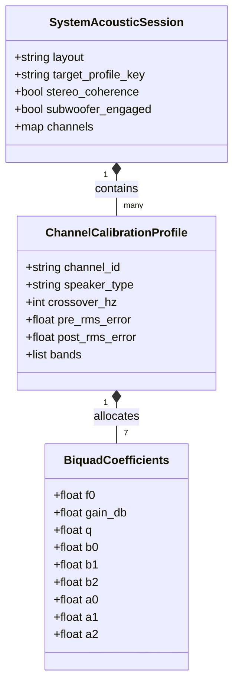

# Data Model: Ground-Truth Empirical PEQ Calibration & Multichannel Architecture

## Entities

### 1. BiquadCoefficients
Encapsulates discrete transfer function parameters for a second-order IIR biquad section under $F_s = 48\text{ kHz}$.

| Field | Type | Description |
| :--- | :--- | :--- |
| `f0` | `float` | Center frequency in Hz (snapped to Yamaha register table) |
| `gain_db` | `float` | Filter gain in dB (-12.0 dB to +3.0 dB, 0.5 dB resolution) |
| `q` | `float` | Quality factor (0.500 to 10.08) |
| `b0`, `b1`, `b2` | `float` | Numerator polynomial coefficients |
| `a0`, `a1`, `a2` | `float` | Denominator polynomial coefficients |

### 2. ChannelCalibrationProfile
Encapsulates the calibration state and 7 PEQ bands for a specific audio channel.

| Field | Type | Description |
| :--- | :--- | :--- |
| `channel_id` | `enum` | `L`, `R`, `C`, `SW`, `SL`, `SR`, `SBL`, `SBR` |
| `speaker_type` | `enum` | `LARGE`, `SMALL` |
| `crossover_hz` | `int` | Crossover cutoff frequency (e.g. 80 Hz, or 0 if LARGE) |
| `bands` | `BiquadCoefficients[7]` | Array of exactly 7 discrete hardware bands |
| `pre_rms_error` | `float` | RMS deviation from target curve before PEQ (dB) |
| `post_rms_error` | `float` | RMS deviation from target curve after PEQ (dB) |
| `modal_attenuation_db` | `float` | Total peak modal energy attenuated (dB) |

### 3. SystemAcousticSession
Encapsulates a full room calibration session across all active channels.

| Field | Type | Description |
| :--- | :--- | :--- |
| `layout` | `enum` | `STEREO_2_0`, `STEREO_2_1`, `SURROUND_5_1`, `SURROUND_7_1` |
| `target_profile_key` | `string` | Active target profile identifier (e.g. `harman_wide_room`) |
| `channels` | `map<string, ChannelCalibrationProfile>` | Channel calibration map |
| `stereo_coherence` | `bool` | True if stereo pair (L/R) has frequency-aligned bands |
| `subwoofer_engaged` | `bool` | True if subwoofer bass management is active |
| `timestamp` | `string` | ISO 8601 creation timestamp |

## Class Diagram

