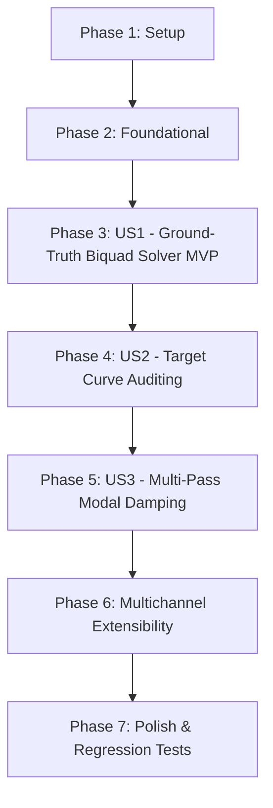

# Tasks: Ground-Truth Empirical PEQ Calibration & Multichannel Architecture

**Input**: Design documents from `/specs/010-ground-truth-peq-math/`
**Prerequisites**: `plan.md`, `spec.md`, `research.md`, `data-model.md`, `contracts/api_contracts.md`, `quickstart.md`

## Format: `[ID] [P?] [Story] Description`

- **[P]**: Can run in parallel (different files, no dependencies)
- **[Story]**: Which user story this task belongs to (US1, US2, US3, US4)
- Include exact file paths in descriptions

---

## Phase 1: Setup (Shared Infrastructure)

- [ ] T001 Verify existing test fixtures, empirical data in `data/medicion_promedio_espacial.npz`, and target configurations in `config/targets.json`

---

## Phase 2: Foundational (Blocking Prerequisites)

- [ ] T002 Verify Yamaha discrete register tables (28 discrete frequencies, discrete Q values from 0.500 to 10.08) in `scripts/peq_optimizer.py` and backup `config/targets.json`

**Checkpoint**: Foundation ready - user story implementation can begin.

---

## Phase 3: User Story 1 - Ground-Truth Mathematical Derivation of 7-Band Manual PEQ Filters (Priority: P1 MVP) 🎯 MVP

**Goal**: Derive all 7 PEQ biquad filters per channel directly from rigorous transfer function mathematics ($H(z)$ peaking IIR biquad equations, Robert Bristow-Johnson Audio EQ Cookbook) matching the measured room transfer function against the target curve, strictly below the Schroeder frequency ($\le 500\text{ Hz}$), with zero invented parameters.

**Independent Test**: Execute the biquad solver over real empirical measurement data; verify that the combined transfer function minimizes residual RMS error without quantization clipping or uncoordinated frequency collision.

### Tests for User Story 1

- [ ] T003 [P] [US1] Create unit test in `tests/test_peq_biquad_math.py` verifying exact RBJ biquad transfer function evaluation and complex frequency response summation
- [ ] T004 [P] [US1] Create integration test in `tests/test_peq_optimizer_ground_truth.py` verifying that `optimize_stereo_peq()` outputs exactly 7 discrete Yamaha bands with measurable RMS error reduction

### Implementation for User Story 1

- [ ] T005 [US1] Implement `BiquadFilter` class in `scripts/peq_optimizer.py` computing Robert Bristow-Johnson peaking EQ coefficients ($b_0, b_1, b_2, a_0, a_1, a_2$) and complex frequency response
- [ ] T006 [US1] Refactor `optimize_stereo_peq()` in `scripts/peq_optimizer.py` to use multi-band cascaded biquad transfer function optimization instead of heuristic curve fitting
- [ ] T007 [US1] Integrate ground-truth biquad solver into `/api/calibration/solve_peq` and `/api/finalize_calibration` routes in `scripts/web_calibration_server.py`

**Checkpoint**: User Story 1 fully operational - PEQ filters are mathematically derived from first-principles biquad equations.

---

## Phase 4: User Story 2 - Target Curve Auditing and Selection for 2.0 Bookshelf Systems (August 2026 Benchmark) (Priority: P2)

**Goal**: Audit and realign all 9 community curves in `config/targets.json` for small bookshelf acoustic limitations ($F_3 \approx 64\text{ Hz}$ for Q Acoustics 3020i), enforcing natural low-frequency high-pass protection ($< 60\text{ Hz}$) and a psychoacoustic high-frequency slope (-0.8 to -1.0 dB/octave above 1 kHz).

**Independent Test**: Run curve validation script over `config/targets.json`; confirm zero positive boost below 60 Hz on 2.0 profiles and verified linear high-frequency roll-off across all 9 profiles.

### Tests for User Story 2

- [ ] T008 [P] [US2] Create unit test in `tests/test_target_curves_audit.py` verifying low-frequency roll-off protection below 60 Hz and high-frequency slopes across all 9 profiles in `config/targets.json`

### Implementation for User Story 2

- [ ] T009 [US2] Audit and update all 9 target curve definitions in `config/targets.json` with 2.0 bookshelf acoustic boundary limits and academic literature references
- [ ] T010 [US2] Update `scripts/peq_optimizer.py` target curve generator to dynamically apply high-pass speaker cutoff protection based on active speaker profile

**Checkpoint**: User Story 2 operational - target curves are mathematically and acoustically aligned with 2.0 bookshelf speakers.

---

## Phase 5: User Story 3 - Implementation of Industry-Standard Multi-Pass Optimization Techniques (Priority: P3)

**Goal**: Implement spatial variance weighting (Audyssey MultEQ XT32 paradigm) and peak-priority modal damping (YPAO R.S.C. paradigm), strictly prohibiting positive boost into destructive boundary cancellations.

**Independent Test**: Run optimization over synthetic comb-filtered sweeps; confirm resonant peaks ($Q \ge 2.0$) are attenuated while narrow cancellation dips receive $0.0\text{ dB}$ boost.

### Tests for User Story 3

- [ ] T011 [P] [US3] Create unit test in `tests/test_multipass_modal_damping.py` validating that narrow nulls receive zero boost and low-variance spatial peaks receive priority damping

### Implementation for User Story 3

- [ ] T012 [US3] Implement spatial variance analysis and peak-priority selection in `scripts/peq_optimizer.py`
- [ ] T013 [US3] Enforce strict anti-boosting guard ($0.0\text{ dB}$ cap on cancellation nulls) in `scripts/peq_optimizer.py`

**Checkpoint**: User Story 3 operational - multi-pass commercial optimization techniques prevent phase distortion and amplifier overload.

---

## Phase 6: Multichannel Modular Extensibility (2.0 to 7.1 Architecture)

**Goal**: Parameterize channel slots (`L`, `R`, `C`, `SW`, `SL`, `SR`, `SBL`, `SBR`) across the data model, solver, and Yamaha XML transmitter to support future 2.1, 5.1, and 7.1 setups.

**Independent Test**: Execute multichannel XML generation test; confirm valid YNC command generation for stereo, center, surround, and subwoofer channels.

### Tests for Multichannel Architecture

- [ ] T014 [P] Create unit test in `tests/test_multichannel_peq_routing.py` verifying YNC XML generation and biquad allocation for multichannel topologies (2.0, 2.1, 5.1, 7.1)

### Implementation for Multichannel Architecture

- [ ] T015 Parameterize channel allocations in `scripts/peq_optimizer.py` to support arbitrary active channel lists (`CHANNELS = ["L", "R", ...]`)
- [ ] T016 Update `scripts/yamaha_controller.py` to support multichannel PEQ XML generation and subwoofer bass management routing

**Checkpoint**: Multichannel architecture ready - receiver and software can seamlessly calibrate any speaker layout.

---

## Phase 7: Polish & Cross-Cutting Concerns

**Purpose**: Full regression testing, end-to-end flow validation, and documentation updates.

- [ ] T017 [P] Run full project test suite via `python3 -m unittest discover -s tests -p "test_*.py"`
- [ ] T018 Update `specs/010-ground-truth-peq-math/quickstart.md` with verified execution outputs and report links

---

## Dependencies & Execution Order

### Parallel Opportunities

- **Phase 3 (US1)**: T003 and T004 can run in parallel.
- **Phase 4 (US2)**: T008 can run in parallel with US1 UI integration.
- **Phase 5 (US3)**: T011 can run in parallel with US2 documentation tasks.
- **Phase 6**: T014 can run in parallel with controller parameterization.
- **Phase 7**: T017 and T018 can run in parallel.
